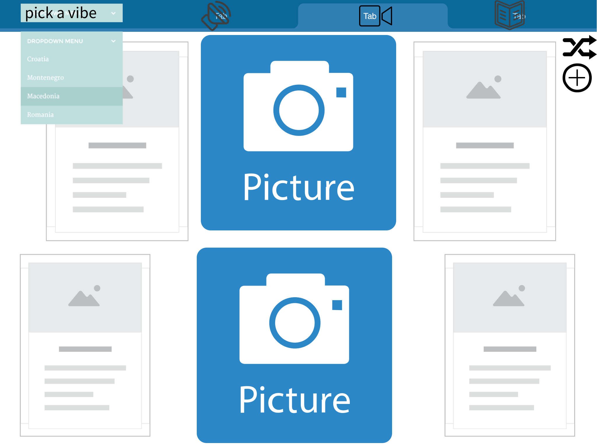
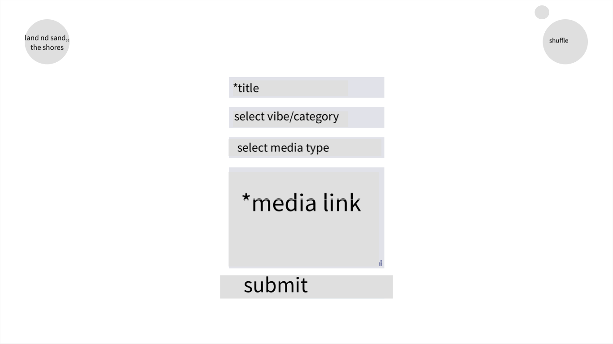
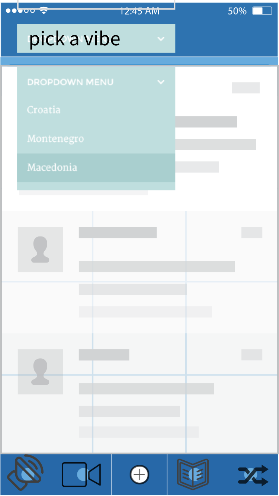
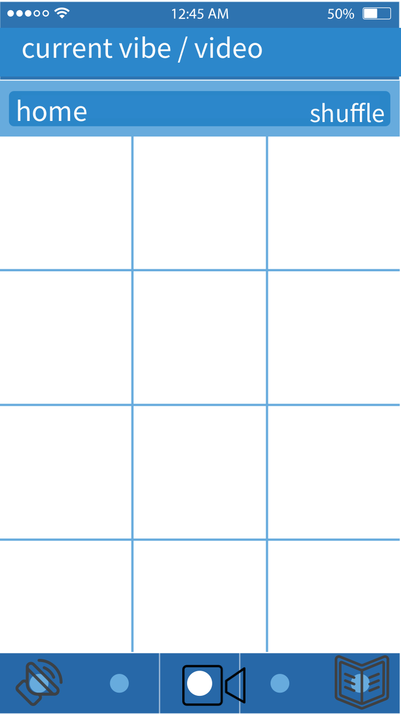
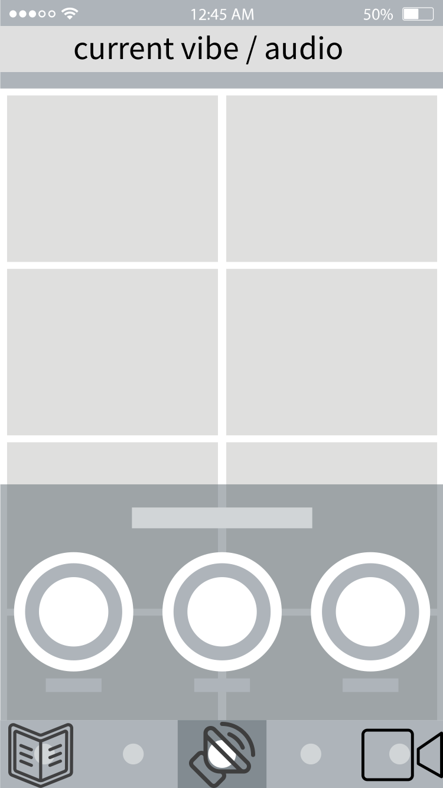
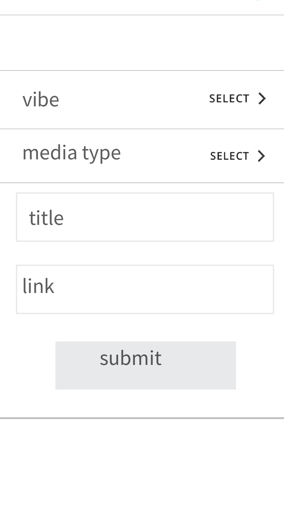

# Project Overview

  A little island of misplaced/bookmarked media. Shuffle your archive of articles you meant to read, songs you wanted to listen to and videos you've had on your watch later list for years.
  this will be the place to consume media in a quiet environment built to decrease distractions//the overwhelm of virtual millieu.

## Project Name

  media shuffle

## Project Description

Post all the videos, songs, articles, images you've saved for later to the appropriate categories. The main shuffle button brings you to a page to consume a single random piece of media from your library. Use the navbar to narrow the scope of the shuffle as well as the library visible on the landing page.
  Post-mvp will enable users to create their own categories.

## Wireframes














## Component Hierarchy


## API and Data Sample

```json
{
    "records": [
        {
            "id": "rectXeFLRVMNXbKa1",
            "fields": {
                "vibe": "songs i heard on tv",
                "link": "https://www.youtube.com/watch?v=UBS4Gi1y_nc",
                "title": "windowlicker - aphex twin",
                "mediaType": "audio"
            },
            "createdTime": "2021-01-19T19:17:37.000Z"
        },
        {
            "id": "rechCkys0dvqNfz6w",
            "fields": {
                "vibe": "interviews with  my sages",
                "link": "https://www.theguardian.com/music/2020/oct/27/joni-mitchell-interview-archives-early-years-cameron-crowe?utm_source=pocket-newtab",
                "title": "Joni Mitchell: 'I'm a fool for love'",
                "mediaType": "article"
            },
            "createdTime": "2021-01-19T19:17:37.000Z"
        },
        {
            "id": "recs7l94ryKkshxN6",
            "fields": {
                "vibe": "so glad i get to be there,, performances on video",
                "link": "https://www.youtube.com/watch?v=eIwiODeHHwc&list=WL&index=3",
                "title": "Sweet Jane - Miley Cyrus (mtv unplugged presents backyard sessions)",
                "mediaType": "video"
            },
            "createdTime": "2021-01-19T19:17:37.000Z"
        }
    ],
    "offset": "recs7l94ryKkshxN6"
}
```

### MVP/PostMVP 

#### MVP 
- Landing page with a 'media shuffle' button and a display of the most recent media added, and a dropdown to route to filtered categories or 'vibes' of content.
- get and post pieces of media from airtable

#### PostMVP  
*These are examples only. Replace with your own Post-MVP features.*

- Enable create vibe/category to tag and filter media
- color palette options
- button to toggle text/image display priority,, image priority reduces text noise, text priority reduces image noise/stimuli

## Project Schedule

This schedule will be used to keep track of your progress throughout the week and align with our expectations. Here's an example.

|  Day | Deliverable | Status
|---|---| ---|
|January 20| Prompt / Wireframes / Priority Matrix / Timeframes | Incomplete
|January 20| Project Approval | Incomplete
|January 21| Core Application Structure (HTML, CSS, etc.) | Incomplete
|January 22| Pseudocode / actual code | Incomplete
|January 23| Initial Clickable Model  | Incomplete
|January 24| MVP Deployment | Incomplete
|January 27| Presentations | Incomplete

## Timeframes

| Component | Priority | Estimated Time | Time Invested | Actual Time |
| --- | :---: |  :---: | :---: | :---: |
| Create base app wrapped in router | H | 1hrs| -- | -- |
| Create components folder with component files | H | 1hrs | -- | -- |
| Working with API | H | 1hrs| -- | -- |
|ShowMedia Component (audio, video, article) | H | 3hrs | -- | -- |
| New Media Form| H | 2hrs | -- | -- |
| MediaLibrary Component | H | 4hrs | -- | -- |
| Link and Route for filtered ML | H | 2hrs | --| -- |
| Styling for Landing/Home | H | 3hrs | -- | -- |
| Styling/transitions for focussed/shown media | 2hrs | -- | -- |
| Total | H | 17hrs| -- | -- |

## SWOT Analysis

### Strengths:

### Weaknesses:

### Opportunities:

### Threats:
